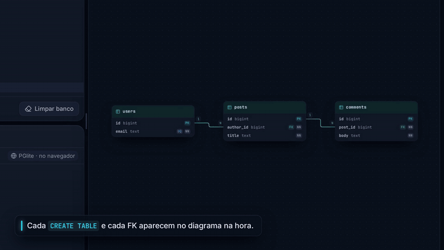
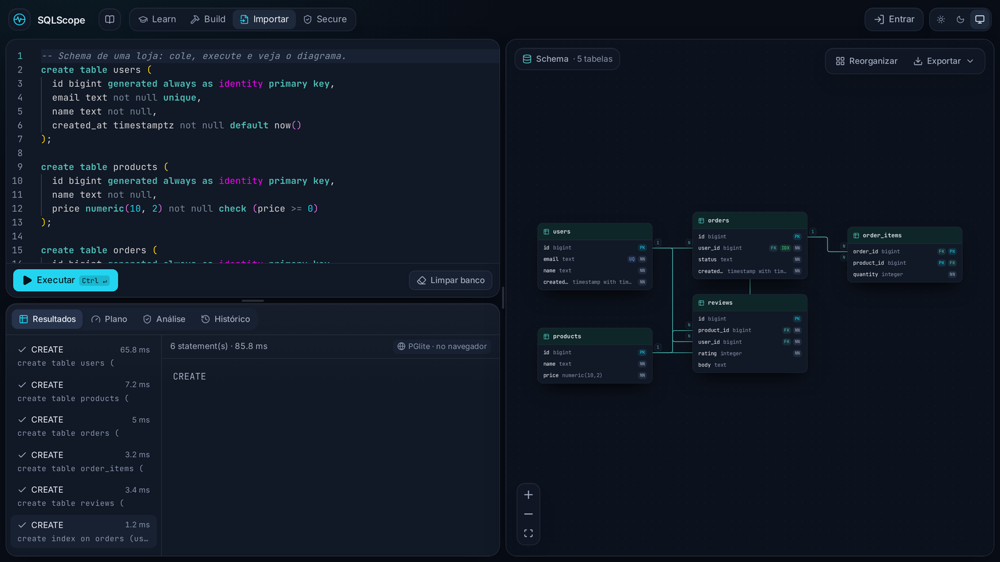
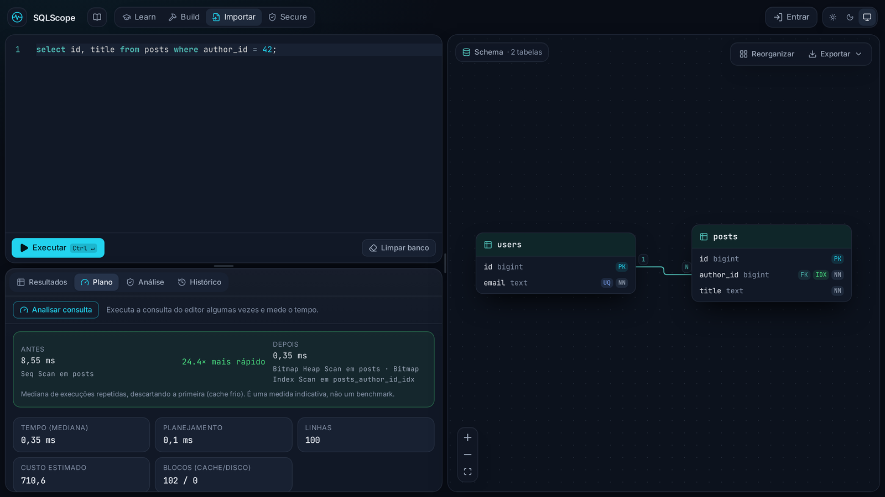
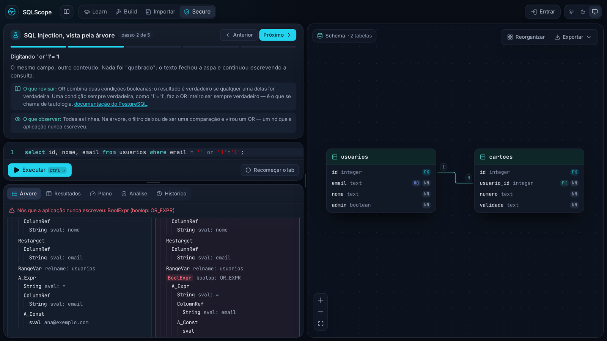
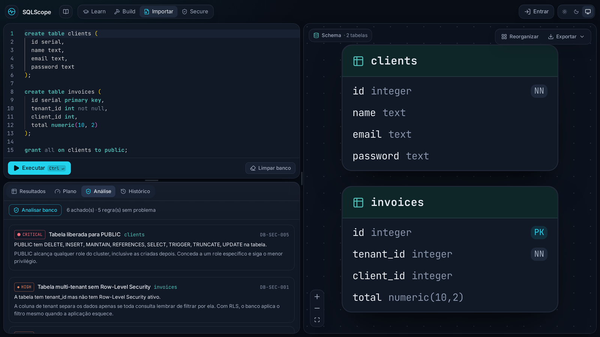
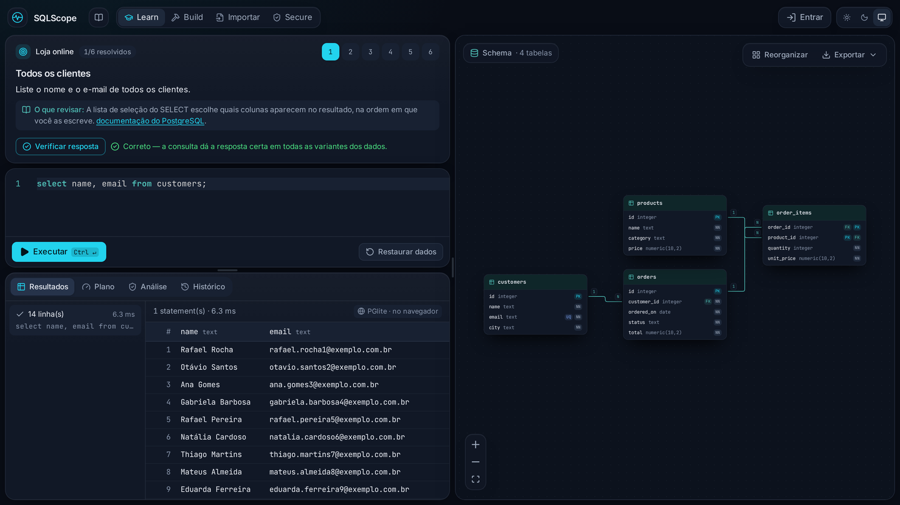
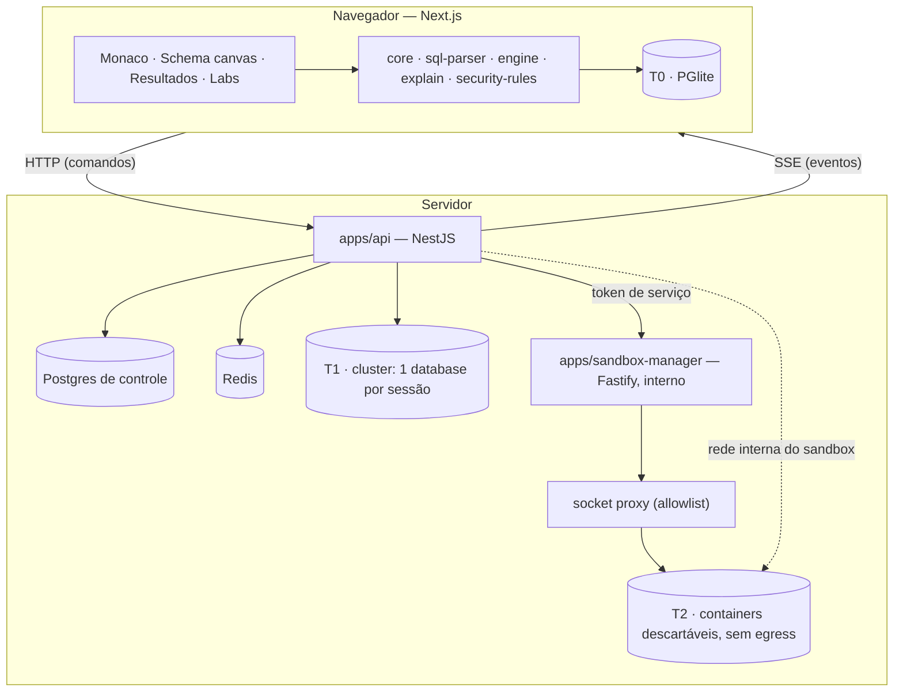
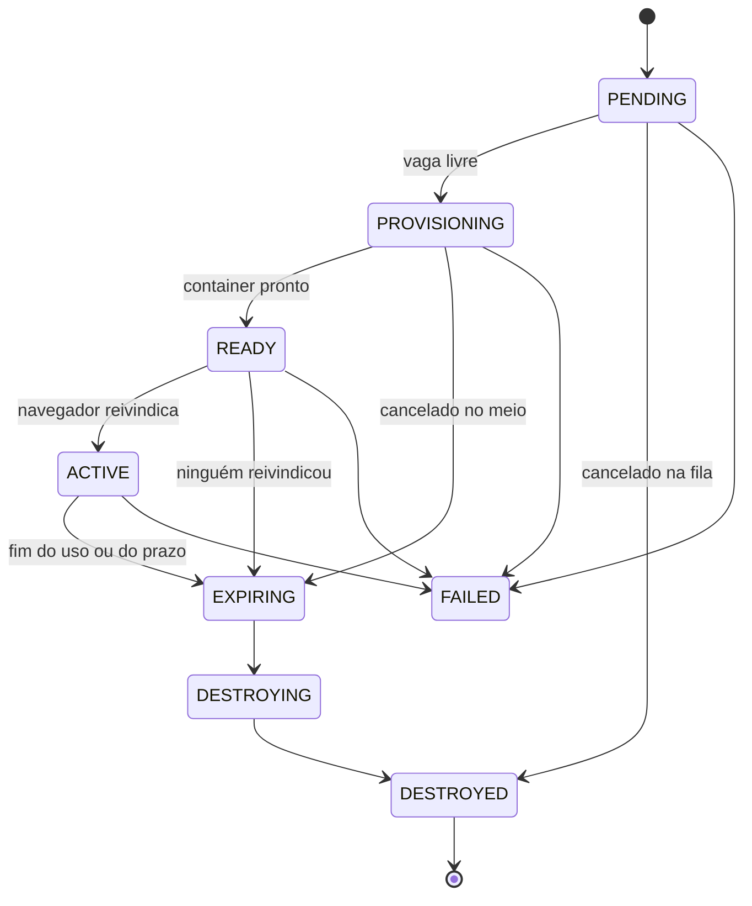
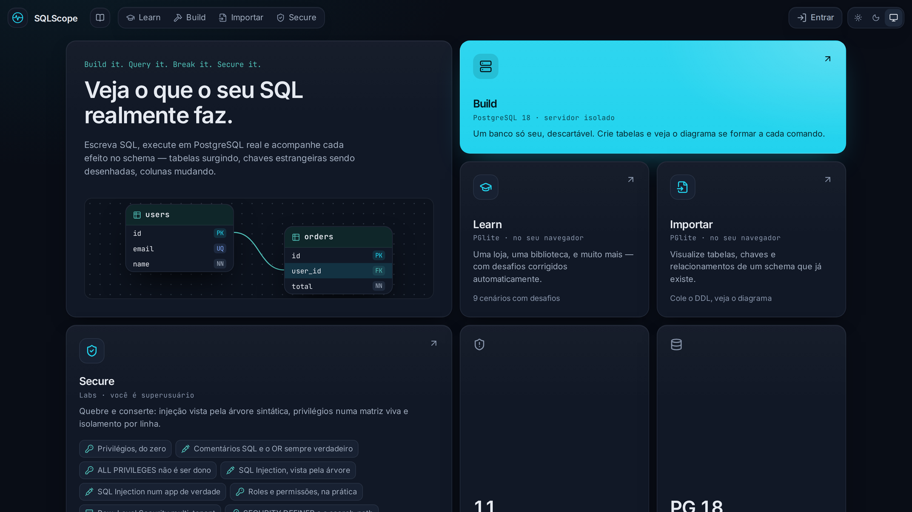
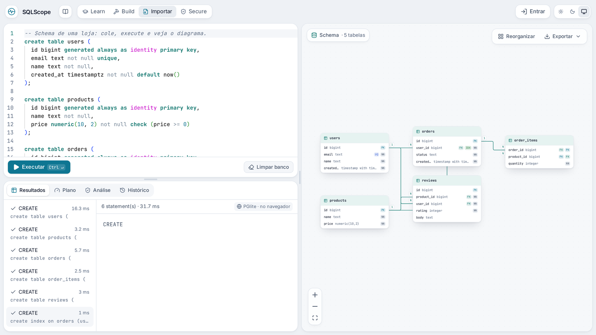

<div align="center">


# SQLScope

**Build it. Query it. Break it. Secure it.**

Um ambiente interativo para construir, medir, atacar e proteger bancos PostgreSQL — com o SQL
rodando em PostgreSQL de verdade e cada efeito mostrado na tela.

[](https://github.com/Mvclr/SQLScope/actions/workflows/ci.yml)


[](LICENSE)

<a href="docs/media/sqlscope-demo.mp4">
  
</a>

**▶ [Assistir à demonstração completa](docs/media/sqlscope-demo.mp4)** · 1 min 36 s, com som

</div>

## Sumário

- [A ideia](#a-ideia)
- [O produto em quatro verbos](#o-produto-em-quatro-verbos)
- [Conteúdo](#conteúdo)
- [Como funciona por dentro](#como-funciona-por-dentro)
- [Segurança do próprio SQLScope](#segurança-do-próprio-sqlscope)
- [Decisões de arquitetura](#decisões-de-arquitetura)
- [Stack](#stack)
- [Qualidade e engenharia](#qualidade-e-engenharia)
- [Design](#design)
- [Estrutura do repositório](#estrutura-do-repositório)
- [Status e roadmap](#status-e-roadmap)
- [Documentação](#documentação)

## A ideia

Clientes SQL e painéis administrativos são ótimos para quem já sabe o que cada comando faz,
mas mostram o banco como texto. Quem executa um `ALTER TABLE ... ADD CONSTRAINT ... FOREIGN KEY`
precisa imaginar o resultado.

O SQLScope inverte isso: **o valor do produto é ver o que o SQL faz**. Cada `CREATE TABLE`
vira um card no diagrama, cada chave estrangeira é desenhada da coluna de origem até a chave de
destino, cada consulta mostra o plano que o banco escolheu, e cada ataque aparece como nós
novos na árvore sintática da consulta.

Nada é simulado. O SQL roda em **PostgreSQL de verdade**: compilado para WebAssembly
([PGlite](https://pglite.dev), PostgreSQL 18) dentro do navegador, ou num PostgreSQL 18 isolado
no servidor. E o SQLScope não filtra SQL: o controle de segurança é o próprio PostgreSQL
(privilégios) e o kernel (cgroups, rede), nunca um parser tentando adivinhar intenção.

## O produto em quatro verbos

| Verbo         | O que você faz                                                      | Onde roda                                  |
| ------------- | ------------------------------------------------------------------- | ------------------------------------------ |
| **Build it**  | Cria tabelas e vê o diagrama se formar a cada comando               | Navegador (Importar) ou servidor (Build)   |
| **Query it**  | Executa, mede o plano real, cria um índice e compara antes e depois | Navegador ou servidor                      |
| **Break it**  | Ataca: injeta SQL e vê a estrutura da consulta mudar                | Navegador; um lab com app real no servidor |
| **Secure it** | Corrige com parâmetros, privilégios e RLS, e audita o banco         | Navegador                                  |

### Build it — o schema nasce na tela



O canvas nunca se esconde: fica ao lado do editor, não numa aba. Toda mudança é mostrada como
mudança, com as mesmas animações no produto inteiro:

- **Tabela nova** entra com escala e fade; **chave estrangeira** é desenhada como uma aresta,
  com a cardinalidade (`1` e `N`) aparecendo ao final; **coluna nova** desliza para dentro do
  card; **remoção** é uma contração com fade.
- Tudo que mudou na última execução ganha um **halo** que decai em cerca de 3 s.
- **Posições estáveis**: um nó movido por você nunca é reposicionado sozinho. O
  [elkjs](https://github.com/kieler/elkjs) só posiciona nós novos; "Reorganizar" refaz o
  layout inteiro, sob demanda.
- Colunas mostram o tipo e selos `PK`, `FK`, `UQ`, `NN` e `IDX`.
- O diagrama **não é deduzido do SQL enviado**: depois de qualquer DDL, o SQLScope lê o
  catálogo do banco e compara com o estado anterior. Um `ALTER` complexo, um `DROP ... CASCADE`
  ou um `ROLLBACK` aparecem exatamente como o PostgreSQL os deixou.

Além do diagrama:

- **Histórico** de cada execução, com _time-travel_ (ver o schema de qualquer momento) e
  **replay**, que reconstrói o banco passo a passo.
- **Exportar** o schema como SQL (DDL, inclusive com políticas RLS), DBML (para o
  dbdiagram.io) ou imagem PNG.
- **Importar**: cole o DDL de um schema existente e veja tabelas, chaves e relacionamentos —
  tudo no navegador, sem enviar nada a um servidor.
- **Link compartilhável**: os scripts vão comprimidos no _fragmento_ da URL, que o navegador
  nunca envia a um servidor. Quem abre reconstrói a sessão no próprio navegador.
- **Contas** (e-mail e senha) para guardar projetos. Um projeto guarda o **SQL** que constrói
  o schema, não o banco: o banco é descartável, e reabrir um projeto é reexecutar a construção.

### Query it — meça, entenda, otimize



O painel **Plano** roda `EXPLAIN (ANALYZE, BUFFERS, FORMAT JSON)` e transforma o resultado
numa árvore tipada, com o tempo real de cada nó, estimado × real, blocos lidos do cache ou do
disco e o caminho de acesso escolhido. Ele também aponta o que pesa: por exemplo, _"Seq Scan
em `posts` lê muito mais do que usa — 99.900 de 100.000 linhas foram lidas e descartadas"_.

O ponto alto é a **comparação antes e depois de um índice**, feita com honestidade estatística:

- cada medida é a **mediana** de execuções repetidas, descartando a primeira (cache frio);
- uma diferença só é apresentada como ganho quando os tempos saem do piso de ruído (1 ms) ou
  quando o **caminho de acesso muda** — em tabelas pequenas, a razão entre dois tempos de
  microssegundos não significa nada, e afirmar o contrário ensinaria errado;
- **instruções que escrevem no banco não são executadas para medir**: recebem só o plano
  estimado, e a interface diz o motivo;
- o verde da interface é **reservado** para "ficou mais rápido": sucesso de execução é neutro.

O editor é o [Monaco](https://microsoft.github.io/monaco-editor/), servido do próprio domínio
(sem CDN). Erros mostram o SQLSTATE e a posição exata no script; os resultados são virtualizados,
com `NULL` distinto de texto vazio e números alinhados à direita; resultados grandes são
truncados de forma explícita, com o limite dito na tela.

### Break it — ataque para entender



O lab de **SQL Injection** parte de uma tese: injeção não é sobre aspas, é sobre **quem decide o
formato da consulta**. A interface mostra duas árvores sintáticas lado a lado — _o que a
aplicação queria_ e _o que o banco recebeu_ — geradas pelo parser real do PostgreSQL
([libpg_query](https://github.com/pganalyze/libpg_query)). O texto digitado não muda um valor:
ele **acrescenta nós**, e os nós que a aplicação nunca escreveu aparecem em vermelho.

O lab tem duas versões:

- **Pela árvore** (no navegador): a tautologia `' or '1'='1`, o `UNION` que lê outra tabela, o
  parâmetro que mantém o formato fixo (`ParamRef`) e por que **escapar aspas não basta** (num
  contexto numérico não há aspa para escapar).
- **Num app de verdade** (no servidor): você digita só no campo de um app de busca, e é o app que
  monta o SQL. Um container PostgreSQL descartável, sem acesso à rede, recebe a consulta como um
  role de **privilégio mínimo** (`select` só em `usuarios`). A injeção muda o formato da
  consulta, e o `UNION` que tenta roubar os cartões é barrado pelo banco com `42501`. A
  defesa mora no PostgreSQL, não na limpeza do texto.

### Secure it — corrija e audite



Os labs de privilégios e de isolamento por linha têm painéis vivos: uma **matriz role × privilégio**
lida do catálogo a cada execução, com "executar como" outra role, e as **políticas RLS** lidas
do schema. Cada passo diz o que vai acontecer e o que observar, com um link para a documentação
do PostgreSQL sobre o recurso.

O **Security Analyzer** avalia o banco contra 11 regras, cada achado acompanhado do que fazer
a respeito, na mesma escala de severidade (`info`, `warning`, `high`, `critical`) usada em todo
o produto:

| Regra           | Severidade | O que detecta                                |
| --------------- | ---------- | -------------------------------------------- |
| `DB-SCHEMA-001` | warning    | Tabela sem chave primária                    |
| `DB-PERF-001`   | info       | Chave estrangeira sem índice                 |
| `DB-PERF-002`   | info       | Índices redundantes                          |
| `DB-SEC-001`    | high       | Tabela multi-tenant sem Row-Level Security   |
| `DB-SEC-002`    | warning    | RLS ativo sem nenhuma política               |
| `DB-SEC-003`    | info       | RLS não vale para o dono da tabela           |
| `DB-SEC-004`    | high       | Coluna sensível (senha, token…) em texto     |
| `DB-SEC-005`    | critical   | Tabela liberada para `PUBLIC`                |
| `DB-SEC-006`    | high       | Schema em que qualquer um pode criar objetos |
| `DB-SEC-007`    | warning    | Role com privilégios além do necessário      |
| `DB-SEC-008`    | high       | Role de login com poderes administrativos    |

Uma regra que precisa de privilégios e não os recebe (as quatro últimas) aparece como **não
avaliada**, nunca como aprovada: uma verificação que não rodou não encontrou nada.

## Conteúdo

### Learn — 9 cenários, 50 desafios



Cada cenário é um schema com dados e uma sequência de desafios de SQL, com dica opcional e um
link para o conceito na documentação do PostgreSQL. A correção é feita **contra três variantes
do conjunto de dados**, comparando os resultados como multiconjuntos: uma resposta com valores
fixos falha, e qualquer SQL equivalente à solução passa. O progresso fica no navegador.

| Nível             | Cenário                                                                                           |
| ----------------- | ------------------------------------------------------------------------------------------------- |
| **Iniciante**     | Loja online · Biblioteca · Escola (agregações, `JOIN`, `LEFT JOIN`, `GROUP BY`)                   |
| **Intermediário** | Streaming · Clínica · Aeroporto (subconsultas, "o último de cada", "quem nunca…")                 |
| **Avançado**      | Folha de pagamento · Organograma · Banco (funções de janela, saldo corrido, hierarquia recursiva) |

### Secure — 9 laboratórios, 45 passos

| Nível             | Laboratório                                | Passos | Onde roda    |
| ----------------- | ------------------------------------------ | ------ | ------------ |
| **Iniciante**     | Privilégios, do zero                       | 5      | Navegador    |
|                   | Comentários SQL e o `OR` sempre verdadeiro | 3      | Navegador    |
|                   | `ALL PRIVILEGES` não é ser dono            | 5      | Navegador    |
| **Intermediário** | SQL Injection, vista pela árvore           | 5      | Navegador    |
|                   | SQL Injection num app de verdade           | 4      | **Servidor** |
|                   | Roles e permissões, na prática             | 8      | Navegador    |
| **Avançado**      | Row-Level Security multi-tenant            | 6      | Navegador    |
|                   | `SECURITY DEFINER` e o `search_path`       | 5      | Navegador    |
|                   | Políticas permissivas e restritivas        | 4      | Navegador    |

Os labs são **dados**, não código, e cada passo declara duas promessas: o SQLSTATE em que ele
termina (vários ensinam pela recusa) e quantas linhas devolve. Um teste executa todos os labs
do começo ao fim e cobra as duas — se um lab deixar de se comportar como o texto diz, o build
quebra em vez de ensinar errado.

## Como funciona por dentro

### Três camadas de isolamento

Cada módulo usa a camada **mais barata que satisfaz seu modelo de ameaça**. Aprender `SELECT`
não exige um container; testar `CREATE ROLE` e RLS exige poder de superusuário.

| Camada | Mecanismo                                                      | Onde roda | Usada por                                          |
| ------ | -------------------------------------------------------------- | --------- | -------------------------------------------------- |
| **T0** | PGlite — PostgreSQL compilado para WebAssembly                 | Navegador | Learn, Importar, labs Secure (você é superusuário) |
| **T1** | Um _database_ e um _role_ por sessão num cluster compartilhado | Servidor  | Build, plano de execução, comparação de índices    |
| **T2** | Container PostgreSQL dedicado, descartável e sem acesso à rede | Servidor  | Lab de injection com app real                      |



A API nunca toca o Docker: quem tem o socket é o **sandbox-manager**, um processo separado e
não exposto, e ainda assim só através de um _socket proxy_ que libera apenas containers e redes.
Há quatro redes Docker distintas (`public`, `control`, `sandbox` e `docker-api`); o banco de
controle não está na rede dos sandboxes, e cada sandbox T2 tem uma rede interna só dele.

### Executar SQL

O mesmo `runScript` roda no navegador (sobre o PGlite) e na API (sobre o PostgreSQL), porque
ambos falam com a mesma interface `SqlSession`, e uma **suíte de contrato roda os mesmos testes
nas duas engines**.

1. O parser real do PostgreSQL divide o script em instruções e classifica cada uma (muda o
   catálogo? muda dados?), com as posições convertidas para índices que o editor entende.
2. Cada instrução roda num cursor, com limite de linhas **e** de bytes, e um _watchdog_ de
   tempo. Um erro de SQL é um **resultado** com posição no script, não uma exceção HTTP.
3. Se algo pode ter mudado o catálogo, o banco é lido de novo (`SchemaSnapshot`) e comparado
   com o anterior (`diffSnapshots`). Os objetos são pareados por identidade de catálogo
   (oid, `attnum`), não por nome — por isso um _rename_ aparece como rename, não como
   `DROP` + `CREATE`.
4. O evento vai para o log da sessão (append-only, de onde saem o time-travel e o replay) e,
   por SSE, para as outras abas.

### Ciclo de vida de um sandbox T2

O sandbox-manager funciona como um _controller_ de Kubernetes: um laço de **reconciliação**
compara o estado desejado (banco de controle) com o observado (containers no Docker) e converge
a diferença. Container sem registro é destruído; registro sem container falha; registro expirado
é desmontado. Tudo é idempotente, e os containers carregam _labels_ com o prazo, então a
limpeza funciona mesmo com o banco de controle fora do ar.



O número de sandboxes simultâneos é limitado (padrão: 4), e o excedente **espera numa fila com
posição visível**. A fila vive no PostgreSQL, com `pg_advisory_xact_lock`, o que continua
correto com mais de uma réplica. O serviço expõe métricas Prometheus (sandboxes por estado,
tamanho da fila, tempo de provisionamento, falhas, órfãos coletados, passadas de reconciliação).

### Limites da demonstração

Valores padrão da API, todos configuráveis:

| Limite                                | Padrão              |
| ------------------------------------- | ------------------- |
| Ociosidade até a sessão ser destruída | 20 min              |
| Duração máxima de uma sessão          | 120 min             |
| Sessões ativas / por cliente          | 100 / 3             |
| Tamanho máximo do banco de uma sessão | 64 MB               |
| Tempo máximo por instrução            | 5 s                 |
| Resultado devolvido                   | 1.000 linhas · 2 MB |

## Segurança do próprio SQLScope

Um site que executa SQL arbitrário de estranhos tem de ser tratado como alvo. A regra que
organiza tudo: **o controle de segurança é o PostgreSQL e o kernel; a aplicação nunca tenta
filtrar SQL**. Parsing serve à experiência de uso, nunca à defesa.

- **Roles sem poder**: o role de cada sessão não é superusuário nem tem `CREATEROLE`,
  `CREATEDB` ou acesso a arquivos do servidor, tem limite de conexões, e só conecta no próprio
  database. Extensões perigosas (`dblink`, `postgres_fdw`, `file_fdw`) ficam de fora.
- **Limite de tempo que o usuário não desliga**: `statement_timeout` é um parâmetro de sessão
  que qualquer role altera com `SET`. O limite que vale é um _watchdog_ externo que cancela o
  backend, coberto por um teste que roda `SET statement_timeout = 0; SELECT pg_sleep(30)` e exige
  o cancelamento.
- **T2 sem rede**: rede interna sem gateway, limites de CPU, memória e processos, disco em
  `tmpfs` e prazo máximo. O `spec` do container é montado só de constantes e configuração —
  nunca de campos do pedido —, com teste garantindo que não há `Privileged`, `Binds` nem
  `CapAdd`.
- **Contas**: senhas com argon2id (19 MiB, 2 passes, linha de base da OWASP), cookie `httpOnly`
  assinado e `SameSite=Lax`, e a mesma resposta (no mesmo tempo) para e-mail inexistente e senha
  errada. O endereço do cliente nunca é guardado, só um HMAC dele.
- **Bordas**: a API só escuta em loopback; o web é a única entrada pública e descarta o
  `X-Forwarded-For` do cliente para que ninguém troque de identidade e fure a cota; cabeçalhos
  de segurança em toda resposta; e a API se recusa a subir em produção com um segredo que vem
  no repositório.
- **Links compartilhados**: o payload é descomprimido com teto de tamanho, para que um link
  malicioso não decida quanta memória a aba usa.

Ameaças consideradas: acesso a arquivos e execução via funções de servidor, pivô de rede
por FDW, exaustão de recursos, acesso ao banco de controle, fuga de container e abuso da
demonstração pública (prazo curto, cota por cliente, limite global e fila).

## Decisões de arquitetura

Cada decisão importante tem um registro (ADR) com contexto, alternativas e consequências —
inclusive as correções, quando a decisão original estava errada.

| ADR                                                     | Decisão                                                                            |
| ------------------------------------------------------- | ---------------------------------------------------------------------------------- |
| [0001](docs/adr/0001-isolamento-em-camadas.md)          | Isolamento em camadas (T0, T1, T2) em vez de um container por sessão               |
| [0002](docs/adr/0002-sandbox-manager-separado.md)       | Sandbox Manager separado, com reconciliação e socket proxy                         |
| [0003](docs/adr/0003-introspeccao-e-parser.md)          | O catálogo do banco é a fonte da verdade do diagrama; libpg_query para classificar |
| [0004](docs/adr/0004-historico-como-log-de-eventos.md)  | Histórico como log de eventos append-only (time-travel, replay, links)             |
| [0005](docs/adr/0005-transporte-http-sse-ws.md)         | HTTP para comandos, SSE para eventos, WebSocket só onde for indispensável          |
| [0006](docs/adr/0006-security-analyzer-regras-puras.md) | Security Analyzer como regras puras sobre um snapshot                              |
| [0007](docs/adr/0007-monorepo-e-stack.md)               | Monorepo e escolhas de stack                                                       |
| [0008](docs/adr/0008-contas-e-projetos.md)              | Contas guardam SQL, não bancos                                                     |
| [0009](docs/adr/0009-labs-no-navegador.md)              | Labs de segurança rodam no navegador (T0)                                          |
| [0010](docs/adr/0010-labs-t2-integracao.md)             | Integração dos labs T2: API ↔ sandbox-manager                                      |

## Stack

| Área                | Tecnologias                                                                                                       |
| ------------------- | ----------------------------------------------------------------------------------------------------------------- |
| **Web**             | Next.js 16 (App Router) e React 19, Tailwind CSS 4, Monaco, React Flow + elkjs, Zustand, TanStack Query e Virtual |
| **API**             | NestJS 12 (monólito modular), Prisma 7 só no banco de controle, `pg` puro nos sandboxes, Redis, Zod, pino         |
| **Sandbox Manager** | Fastify 5, `prom-client`, Docker via socket proxy                                                                 |
| **Bancos**          | PostgreSQL 18, PGlite (PostgreSQL 18 em WebAssembly), libpg_query 18                                              |
| **Monorepo**        | TypeScript 6, pnpm 11, Turborepo                                                                                  |
| **Testes**          | Vitest, Testcontainers                                                                                            |
| **Entrega**         | Docker Compose, GitHub Actions, imagens multi-arquitetura no GHCR                                                 |

## Qualidade e engenharia

- **554 testes unitários** (mais os de integração) em dez pacotes e apps, com o `SqlSession`
  coberto por uma **suíte de contrato que roda nas duas engines** — PGlite e PostgreSQL real.
- **Integração contra infraestrutura de verdade** com Testcontainers: a API completa, o contrato
  no PostgreSQL 18 e o sandbox-manager contra o Docker, com um **teste de caos** que mata containers
  à força numa rodada aleatória reproduzível e verifica que a reconciliação converge.
- **Conteúdo verificado como código**: os desafios do Learn são executados contra as três
  variantes de dados, e os labs, do primeiro ao último passo.
- **CI em três frentes**: lint, tipos, testes e build; integração; e um _smoke test_ da pilha
  inteira em `docker compose`, que confere, entre outras coisas, que o cluster de sandboxes **não
  alcança** o banco de controle, que a API **não alcança** o Docker, que o socket proxy só
  permite containers e redes, que um lab T2 roda de ponta a ponta e que nada sobra depois.
- **Entrega reproduzível**: um workflow publica as imagens `web`, `api`, `api-migrate` e
  `sandbox-manager` (`amd64` e `arm64`) e o servidor apenas as baixa — [docs/DEPLOY.md](docs/DEPLOY.md).
- **Commits convencionais** e mensagens que explicam o porquê — [CONTRIBUTING.md](CONTRIBUTING.md).

## Design

<table>
  <tr>
    <td width="50%"></td>
    <td width="50%"></td>
  </tr>
</table>

Interface calma e densa, no espírito de um osciloscópio: **precisão instrumental, nada decorativo**.

- **Bento**: cada área é um bloco arredondado, separado por espaço em vez de linhas; o espaço
  entre dois blocos é a alça de redimensionar. No máximo um bloco de destaque por tela.
- **Dois temas de primeira classe**, _Clean Light_ e _Midnight_, escolhidos pelo usuário
  (claro, escuro ou do sistema) e aplicados antes da primeira pintura, sem piscar.
- **Uma linguagem visual só**: a mesma severidade, cor e ícone no Analyzer, nos labs, no editor
  e nos planos, sempre com ícone e rótulo — a cor nunca é o único portador de significado.
- **Acessível**: todo texto tem contraste WCAG AA (mínimo medido de 4,5:1 nos dois temas), foco
  visível, canvas navegável por teclado e mudanças anunciadas em região `aria-live`.
- **Movimento com propósito**, todo desligado por `prefers-reduced-motion`.
- **Sem dependências externas em tempo de execução**: fontes (Inter e JetBrains Mono) e Monaco
  saem do próprio servidor.

## Estrutura do repositório

```
apps/
  web/              Next.js — editor, resultados, diagrama, Learn, Build, Importar e Secure
  api/              NestJS — sessões T1, execução, SSE, contas, rate limit, reaper, labs T2
  sandbox-manager/  Fastify — containers T2: fila, reconciliação, métricas
packages/
  core/             SqlSession, introspecção, SchemaSnapshot, diff, export — PGlite e PostgreSQL
  sql-parser/       libpg_query: divisão, classificação e posições
  engine/           runScript e analyzeQuery, iguais no navegador e na API
  explain/          plano do EXPLAIN em árvore tipada, com observações
  security-rules/   as 11 regras do Security Analyzer, puras
  scenarios/        cenários do Learn como dados, e o validador por variantes
  labs/             labs do Secure como dados, e o construtor da consulta do mini-app
infra/              bootstrap do cluster de sandboxes e do banco do manager
patches/            patch do libpg-query para localizar o WASM no navegador
docs/               arquitetura, design, roadmap, deploy e os ADRs
```

## Status e roadmap

| Fase | Entrega                                                                                  | Estado          |
| ---- | ---------------------------------------------------------------------------------------- | --------------- |
| 0    | Fundação: monorepo, CI, `core` testado nas duas engines                                  | ✅ Concluída    |
| 1    | Playground visual: editor, canvas animado, Learn, Build, Importar, histórico             | ✅ Implementada |
| 2    | Desempenho e análise: plano, comparação de índice, Security Analyzer, contas, exportação | ✅ Implementada |
| 3    | Sandbox T2 e labs de segurança: 9 labs, sandbox-manager e o app de injection             | ✅ Implementada |
| 4    | Transações e concorrência: atomicidade, isolation levels, locks e deadlock               | ⏳ Próxima      |

Pendente antes da v1.0: o **deploy público** (falta um servidor) e decidir como o link
compartilhado deve avisar antes de reexecutar SQL de um estranho. Depois da v1.0: um servidor
**MCP** que expõe schema, plano e relatório de segurança a agentes de IA, observabilidade com
OpenTelemetry e labs extras (pool de conexões, dados sensíveis, N+1). Detalhes no
[roadmap](docs/ROADMAP.md).

## Documentação

- [Conceito original](docs/concept.md) — a visão do produto
- [Arquitetura](docs/ARCHITECTURE.md) — fluxos, pacotes e módulos em detalhe
- [Design](docs/DESIGN.md) — princípios, tokens, animações e acessibilidade
- [Roadmap](docs/ROADMAP.md) — fases e estado de cada item
- [Deploy](docs/DEPLOY.md) — imagens, `compose.prod.yaml` e servidor
- [Desenvolvimento local](docs/DEVELOPMENT.md) — para rodar e contribuir
- [Como contribuir](CONTRIBUTING.md) — convenção de commits
- [Decisões de arquitetura](docs/adr/) — os dez ADRs

## Licença

[MIT](LICENSE)
